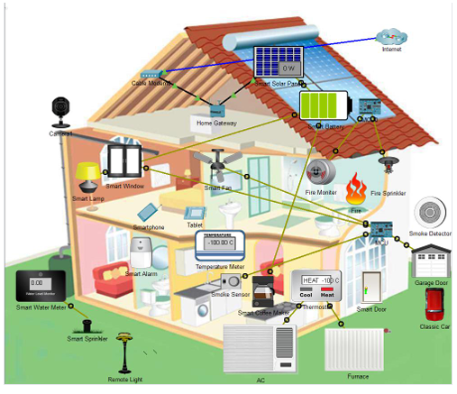
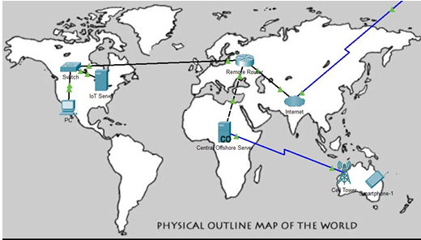

<body>

  <h1>🌐 IoT-Based Smart Home System</h1>
  
Welcome to the <strong>IoT-Based Smart Home System</strong> repository! This project focuses on designing and implementing a smart, sustainable, and remotely accessible home automation system using <strong>Internet of Things (IoT)</strong> technology and a <strong>global network infrastructure</strong>.

  <blockquote>🏡 Monitor and control your smart home devices remotely, enhance energy efficiency, and promote intelligent living.</blockquote>

  <section>
    <h2>📖 Overview</h2>
    
This system simulates a smart home environment using <strong>Cisco Packet Tracer</strong> and real-time IoT devices. It enables:

    <ul>
      <li>Automated and remote control of appliances.</li>
      <li>Real-time environmental monitoring (temperature, fire, CO, moisture, etc.).</li>
      <li>Global connectivity via smartphones and centralized servers.</li>
    </ul>
  </section>

  <section>
    <h2>🛠️ Key Features</h2>
    <ul>
      <li><strong>🔥 Fire Detection System</strong> – Fire detectors trigger alarms and sprinklers using microcontrollers.</li>
      <li><strong>🌡 Temperature Monitoring</strong> – Integrated thermostats, air coolers, and heaters respond to environment data.</li>
      <li><strong>🌱 Soil Moisture Monitoring</strong> – Automatically activates lawn sprinklers based on soil moisture levels.</li>
      <li><strong>💡 Home Appliance Control</strong> – Control lights, fans, coffee makers, and more using your smartphone.</li>
      <li><strong>🧯 Carbon Monoxide Detection</strong> – CO sensors trigger automated ventilation for safety.</li>
      <li><strong>📡 Global Connectivity</strong> – Access and control your smart home from anywhere via mobile networks or Wi-Fi.</li>
    </ul>
  </section>

  <section>
    <h2>🎯 Objectives</h2>
    <ul>
      <li>Design an IoT-based smart home system for real-time monitoring and automation.</li>
      <li>Establish secure global connectivity between local devices and central servers.</li>
      <li>Simulate realistic behavior using Cisco Packet Tracer.</li>
      <li>Promote energy-efficient and sustainable living through smart automation.</li>
    </ul>
  </section>

  <section>
    <h2>📐 System Architecture</h2>
    <h3>🖧 Network Topology</h3>
    
Here’s a visual representation of the system topology:

    

    
  <table>
  <tr>
    <th>Component</th>
    <th>Description</th>
  </tr>
  <tr>
    <td><strong>IoT Devices</strong></td>
    <td>Sensors (temp, fire, CO), actuators (sprinklers, lights, etc.)</td>
  </tr>
  <tr>
    <td><strong>Local Server</strong></td>
    <td>Collects data from devices; gateway to the global network</td>
  </tr>
  <tr>
    <td><strong>Central Server</strong></td>
    <td>Offshore analytics, storage, and decision-making system</td>
  </tr>
  <tr>
    <td><strong>Remote Router</strong></td>
    <td>Ensures communication with external systems</td>
  </tr>
  <tr>
    <td><strong>Smartphone</strong></td>
    <td>User interface for control and monitoring</td>
  </tr>
</table>

  </section>

  <section>
    <h2>🔧 Tools & Technologies</h2>
    <ul>
      <li><strong>Cisco Packet Tracer</strong> – Network and IoT simulation</li>
      <li><strong>IoT Devices</strong> – Sensors, actuators, smart appliances</li>
      <li><strong>Mobile Applications</strong> – Real-time control and feedback</li>
      <li><strong>Networking Components</strong> – Switches, routers, servers</li>
    </ul>
  </section>

  <section>
    <h2>📊 Results</h2>
    <ul>
      <li>✅ Real-time environmental monitoring</li>
      <li>✅ Automatic emergency response (e.g., fire sprinklers)</li>
      <li>✅ Global remote appliance control</li>
      <li>✅ Seamless communication between local and offshore servers</li>
    </ul>
    
Below is a sample screenshot from the simulation environment:

    
  </section>

  <section>
    <h2>🚀 Future Improvements</h2>
    <ul>
      <li>🤖 Integration of <strong>Machine Learning</strong> for predictive behavior and anomaly detection</li>
      <li>☀️ Use of <strong>Renewable Energy Sources</strong> to power the smart home</li>
      <li>🧠 Smarter decision-making via AI-based automation</li>
    </ul>
  </section>

  <section>
    <h2>📜 License</h2>
    
This project is licensed under the <strong>MIT License</strong>. Feel free to use, modify, and distribute this project with proper attribution.

  </section>

  <section>
    <h2>👥 Contributors</h2>
    <ul>
      <li><strong>Mohd Areeb Khan</strong></li>
      <li><strong>Kaushik Sarania</strong></li>
      <li><strong>Mithilesh Korochikar</strong></li>
    </ul>
  </section>

</body>
</html>
